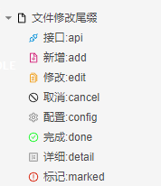
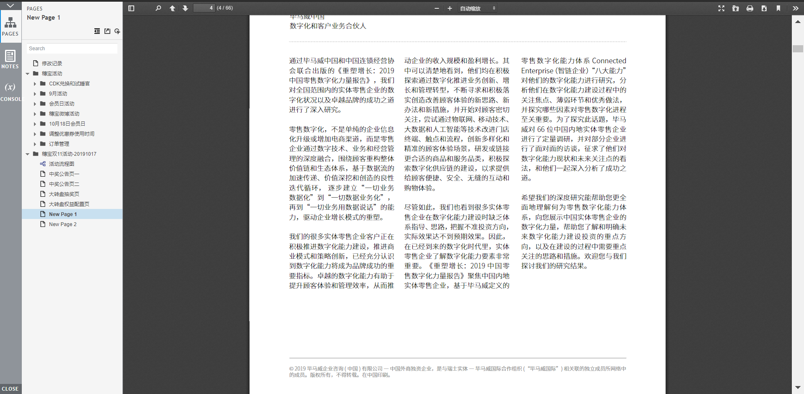

# Extension of Axure 8

## 补丁使用方式

1. 下载替换文件夹；
2. 打开Axure8根目录，备份文件夹DefaultSettings；
3. 将替换文件夹“DefaultSettings”粘贴到Axure8的根目录下（只替换部分文件）；

## Version V3.0

1. 支持元件显示Markdown
2. 支持注释显示Markdown
3. 支持页面图标修改
4. 支持PDF文件在线预览
5. 支持Office文件在线预览

## Version Detail

- [x] 支持元件显示Markdown

1. __输入和输出的控件前缀需要一致，页面js需要通过命名方式知道需要在哪个控件输出Markdown文本__
2. markdown的输入，需要使用文本域控件，命名方式(xxxxx-markdownPriview)
3. markdown的输出，可以使用矩形控件，命名方式(xxxxx)

> 详见Demo

- [x] 支持注释显示Markdown

1. Axure使用时，如果需要支持Markdown格式，在字段命名时加入“:Markdown”即可。

> 详见Demo

- [x] 支持页面图标修改。页面命名使用下列尾缀，可实现图标修改

- [x] 支持PDF文件在线预览。

- [x] 支持OFFICE文件在线预览。

