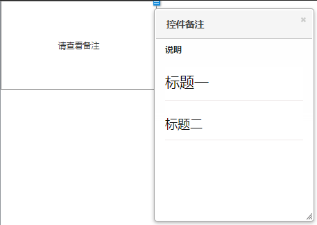

# Axure Extension RP 8 & RP 9

1. Axure RP 8 页面注释、控件注解及文本框控件支持Markdown格式;
1. Axure RP 8 增加页面图标（新增、修改、删除、完成、API、config、标记，详细）;
1. Axure RP 8 增加PDF在线预览;
1. Axure RP 8 增加Office文件在线预览;
1. Axure RP 9 已同步更新 Axure RP 8 功能，但语法稍有不同，详见使用说明；

## Usage for Axure RP 8 : V3.1

1. 下载替换文件夹；
2. 打开Axure8根目录，备份文件夹DefaultSettings；
3. 将替换文件夹“DefaultSettings”粘贴到Axure8的根目录下（只替换部分文件）；

- [x] 支持元件显示Markdown

1. __输入和输出的控件前缀需要一致，页面js需要通过命名方式知道需要在哪个控件输出Markdown文本__
2. markdown的输入，需要使用文本域控件，命名方式(xxxxx-markdownPriview)
3. markdown的输出，可以使用矩形控件，命名方式(xxxxx)

> 详见Demo

- [x] 支持注释显示Markdown

1. Axure使用时，如果需要支持Markdown格式，在字段命名时加入“:Markdown”即可。

> 详见Demo

- [x] 支持页面图标修改。页面命名使用下列尾缀，可实现图标修改

- [x] 支持PDF文件在线预览。

> 详见Demo

- [x] 支持OFFICE文件在线预览。

> 详见Demo

---

## Usage for Axure RP 9 : V2.0

1. 下载替换文件夹
2. 打开Axure 9根目录，备份文件夹DefaultSettings
3. 将替换文件夹“DefaultSettings”粘贴到Axure 9的根目录下（只替换部分文件）

> 详见Demo

- [x] 支持注释显示Markdown

1. Axure使用时，如果需要支持Markdown格式，在字段命名时加入“:Markdown”即可。

> 详见Demo

- [x] 支持页面图标修改。页面命名使用下列尾缀，可实现图标修改

- [x] 支持PDF文件在线预览。

> 详见Demo

- [x] 支持OFFICE文件在线预览。

> 详见Demo
